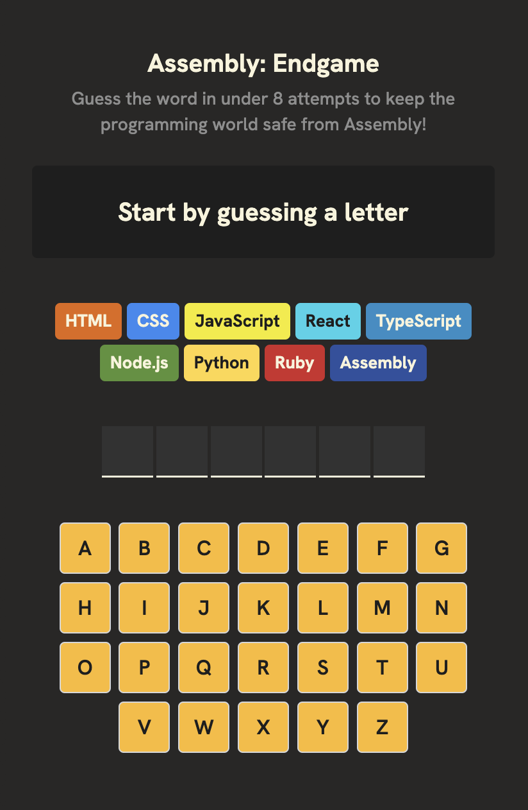
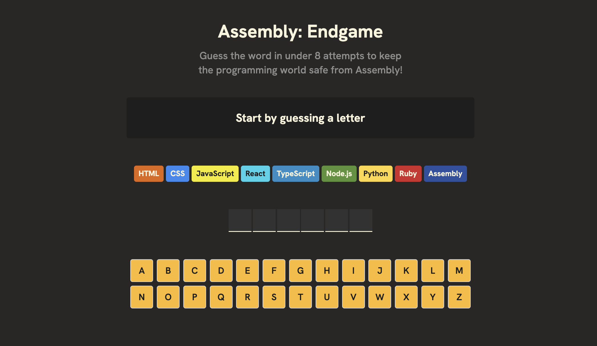

# Assembly Endgame

The project was developed as part of the Scrimba React Basics module. Assembly Endgame was the final capstone project of the entire module.

## Project Overview

I wanted to really test my skills and see how much I had learned throughout the module. Therefore, I instead of following along with the tutorial, created and worked ahead of the tutorial before watching and working through each of the sections.

Also, I wanted to test out a couple different things like running the project locally, using many CSS files for better organization, and actually developing with a mobile-first approach.

## Game Overview

The game is a hangman style game, however, aimed more at programers. You have a set amount of chances to guess the word.

If you guess the word correctly, the world is safe from the programming language Assembly. If you don't, the world is doomed.

With each incorrect guess the world looses a programming language, until only Assembly is left.

## Screenshots

### Mobile View

### Desktop View

## Next Steps

This project is now complete and means I am finally finished with the Scrimba React Basics module. I will be moving on to the next module, Advanced React. Super excited to keep improving my React skills.

## Credits

Scrimba React Basics Module
