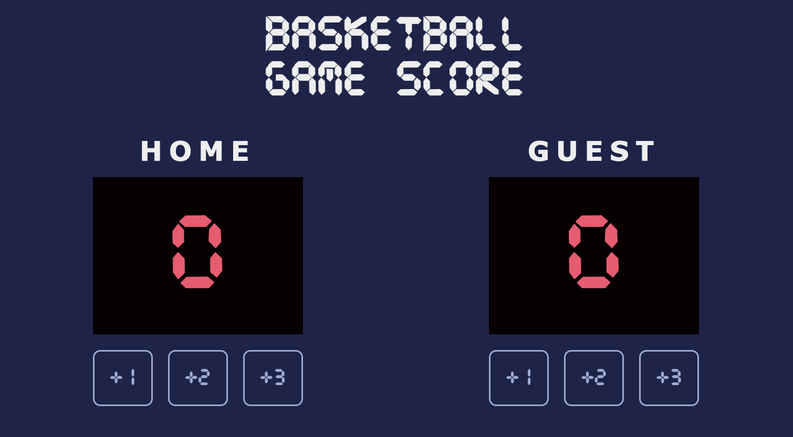
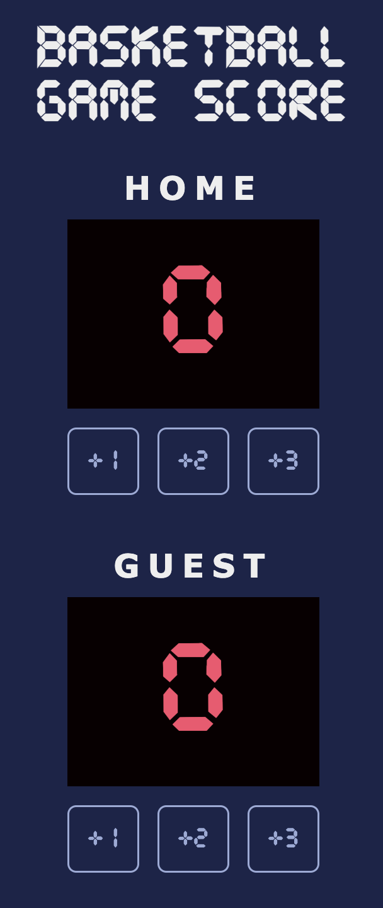

# Basketball Scoreboard

This is one of the early on projects on Scrimba for javascript. We were given a design file with a basketball scoreboard and we had to recreate it using HTML, CSS, and Javascript to make it interactive.

See the design file here: [Design File](./design-file.png)

Although a simple project, it was a good introduction to using javascript to update the DOM and make the app interactive. Can't wait to progress further through the course and start working on more complex projects.

## What I added

- I used javascript functions for the onclick event listeners that passed parameters to the functions to update the score.
- Responsive design for smaller screen sizes. The app will display the score in a vertical layout for smaller screens.

## Live Demo

You can view the live version of the project here: [Live Demo Link](https://jason-scrimba.netlify.app/basketball-scoreboard/)

## Screenshots

### Desktop

  

### Mobile

  

## Credits

- Scrimba for the design file and the idea for the project.
